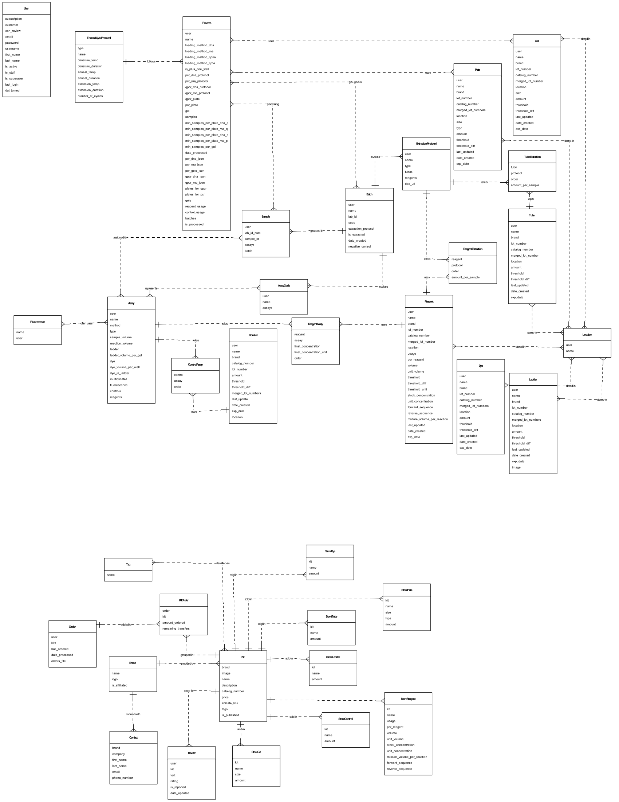

# PCRprep Project - PCR Paperwork Digital Workflow

The purpose of this project is create paperwork for lab technicians doing PCR by:

1 - Creating and tracking inventory of reagents.
2 - Creating assays.
3 - Creating plates and locations of samples.

## Watch a demonstration video here:
https://www.youtube.com/embed/IJtDBgoFGRQ?si=VzWnSYkphX34KlvX

## Database Schema

### Schema details
* The `User` table is alone as it has a many-to-one relationship with almost all tables of the rest of the first schema.
* The second schema below refers to the store functionality of PCRprep.

