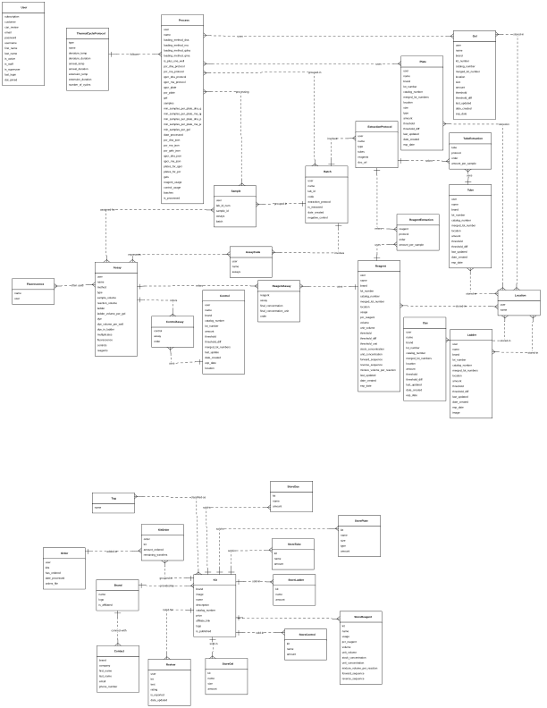

# PCRprep Project - PCR Paperwork Digital Workflow

The purpose of this project is create paperwork for lab technicians doing PCR by:

1 - Creating and tracking inventory of reagents.
2 - Creating assays.
3 - Creating plates and locations of samples.

## Watch a demonstration video here:
<iframe width="560" height="315" src="https://www.youtube.com/embed/IJtDBgoFGRQ?si=VzWnSYkphX34KlvX" title="YouTube video player" frameborder="0" allow="accelerometer; autoplay; clipboard-write; encrypted-media; gyroscope; picture-in-picture; web-share" referrerpolicy="strict-origin-when-cross-origin" allowfullscreen></iframe>

## Database Schema

